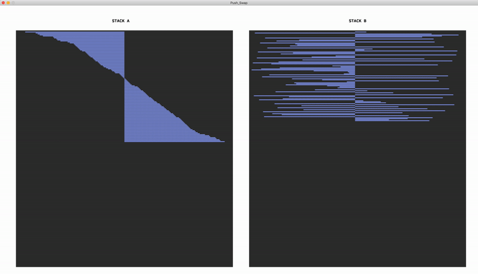

# Push_Swap
## A bespoke sorting algorithm project

Given a list of numbers (positive and negative, no duplicates) sort them in the ascending order using Stack A and Stack B.
The allowed operations are:

*SA:	swap a - swap first 2 elements at the top of stack a
*SB:	swap b - swap first 2 elements at the top of stack b
*SS:	sa and sb at the same time.
*PA:	push a - take the first element at the top of b and put it at the top of a
*PB:	push b - take the first element at the top of a and put it at the top of b
*RA:	rotate a - shift up all elements of stack a by 1
*RB:	rotate b - shift up all elements of stack b by 1
*RR:	ra and rb at the same time
*RRA:	rotate a - shift down all elements of stack a by 1
*RRB:	rotate b - shift down all elements of stack b by 1
*RRR:	rra and rrb at the same time

The checker program supports following flags:
-v:		visualise, graphic representation using MLX library. 450 numbers and less are allowed to visualise. Controls:
		SPACE: play/pause
		RIGHT ARROW: when paused, do 1 operation
		ESC: quit

-c (INT):	used optionally after -v flag to modify stack display color

-t:		total count, performs checking and displays number of operations performed to sort the stack

-i:		display information about the project.
